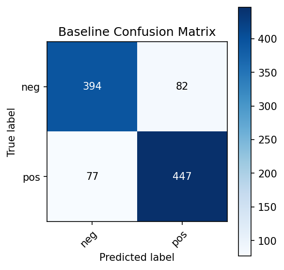
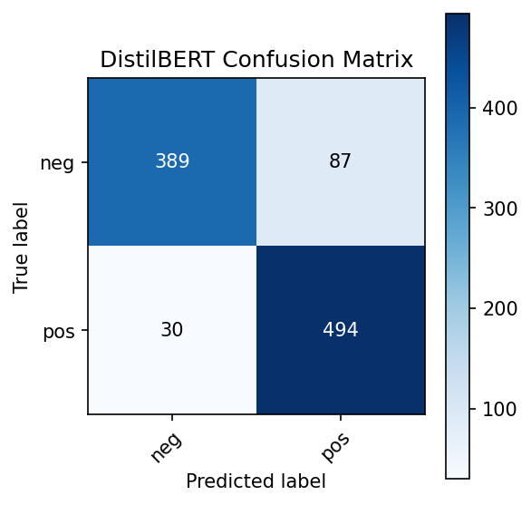

# Advanced Sentiment Analysis: Classical ML vs Transformer Fine-Tuning

This project compares two approaches for binary sentiment analysis on the IMDb movie review dataset:

1. **Classical Machine Learning**
   - TF-IDF vectorization  
   - LinearSVC classifier  

2. **Transformer-based NLP**
   - Fine-tuning `distilbert-base-uncased` using HuggingFace Transformers  
   - Evaluation, confusion matrix, and error analysis  

The goal is to demonstrate practical skills in data preprocessing, classical ML pipelines, transformer fine-tuning, model evaluation, and comparative analysis.

---

## 🚀 Project Workflow

- Load IMDb dataset (subset for faster training)
- Train baseline TF-IDF + LinearSVC model  
- Tokenize dataset for DistilBERT  
- Fine-tune DistilBERT  
- Evaluate both models  
- Generate confusion matrices  
- Perform error analysis  
- Compare classical ML vs Transformer performance

---

## 🧰 Technologies Used

**Libraries**
- Transformers (HuggingFace)  
- Datasets (HuggingFace)  
- PyTorch  
- scikit-learn  
- Matplotlib  
- Accelerate  

**Models**
- `LinearSVC` (classical ML)  
- `distilbert-base-uncased` (transformer)  

---

## 📊 Dataset

- **IMDb Movie Review Dataset**
- Binary sentiment labels:
  - `0` → negative  
  - `1` → positive  
- Subset used for fast training on Colab:
  - **4,000** training samples  
  - **1,000** test samples  

---

## 🔧 Baseline Model — TF-IDF + LinearSVC

### Steps
- Convert text to TF-IDF vectors  
- Train a LinearSVC classifier  
- Evaluate using accuracy & F1-score  
- Plot confusion matrix (saved as PNG)  
- Display 5 misclassified examples  

### Baseline Metrics  

Baseline Accuracy:   0.8410
Baseline F1-score:   0.8410

---

## 🤖 Transformer Fine-Tuning — DistilBERT

### Steps
- Tokenize using DistilBERT tokenizer  
- Apply truncation & dynamic padding  
- Fine-tune with HuggingFace Trainer  
- Evaluate on the test set  
- Plot confusion matrix (saved as PNG)  
- Display 5 misclassified reviews  

### DistilBERT Metrics  

DistilBERT Accuracy: 0.8830
DistilBERT F1-score: 0.8823

**Training results observed:**
- Epoch 1 accuracy: ~0.882  
- Epoch 2 accuracy: ~0.884  
- Final eval accuracy: **≈ 0.884**  
- Final F1-score: **≈ 0.884**

---

## 🔬 Final Comparison

Replace with your real metrics:

Baseline (TF-IDF + LinearSVC)
	•	Accuracy: 0.8410
	•	F1-score: 0.8410

DistilBERT Fine-Tuning
	•	Accuracy: 0.8840
	•	F1-score: 0.8823

**Conclusion:**  
DistilBERT slightly outperforms the classical baseline, demonstrating the strength of transformer architectures while also showing how competitive classical ML can be for text classification tasks.

---

## 📉 Confusion Matrices

After generating them in Colab, place your images inside `outputs/` and reference them like this:

### Baseline Confusion Matrix

### DistilBERT Confusion Matrix

## 👨‍💻 Author

**Batuhan Küçükaydın**  
Software Engineer | Computer Engineer | iOS Developer  
📫 [LinkedIn](https://linkedin.com/in/batuhankucukaydin) • [GitHub](https://github.com/batukucukaydin) • [Medium](https://medium.com/@batukucukaydin)

## ⭐️ Support

If you like this project, please consider giving it a star 🌟  
It really helps me keep building and improving!

